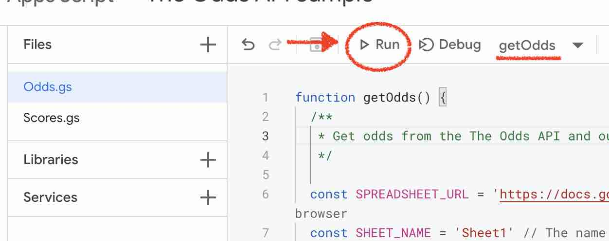
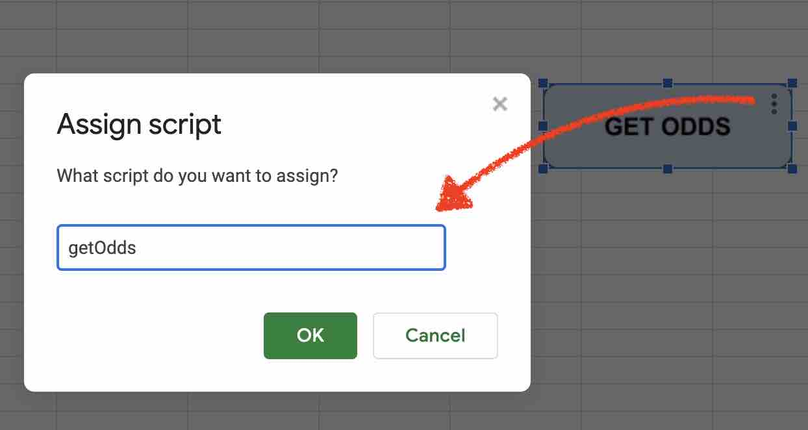
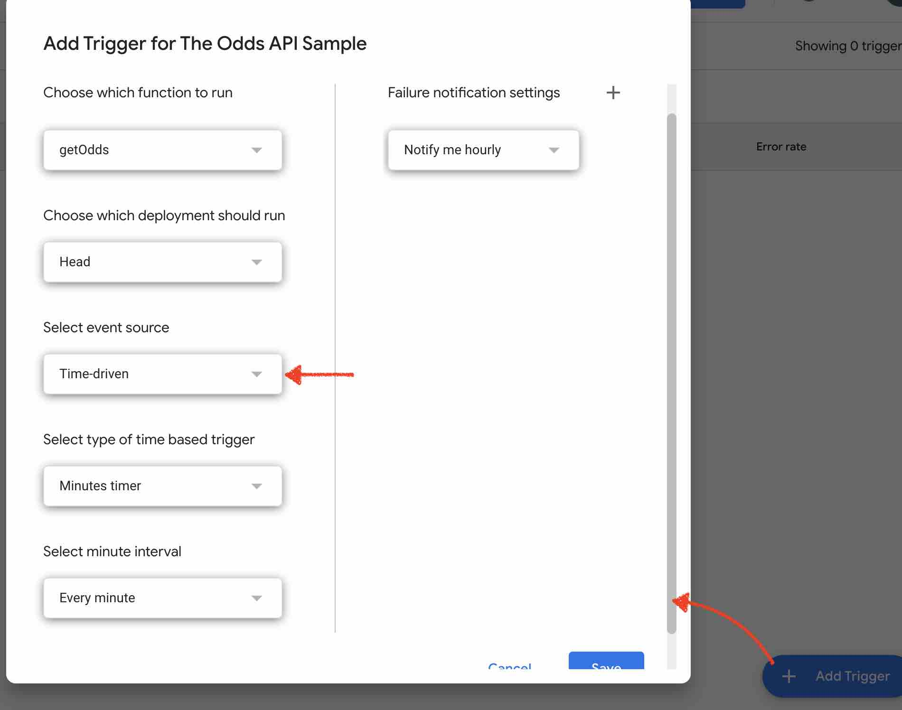

# The Odds API with Apps Script & Google Sheets

Customize the way you bring odds data into Google Sheets.

The Odds API offers an [add-on for Google Sheets](https://workspace.google.com/marketplace/app/sports_odds/426905155013?hl=en&pann=sheets_addon_widget) to bring odds data into a spreadsheet at the click of a button. Whilst the add-on is designed to be easy to use, it is limited in what it can do. This guide is for users who want more control and flexibility in the way they bring odds data into their spreadsheets. It doesn't require coding skills, but it does require some tweaks to the code in order set up the requests.

Use this guide to:

- Customize the request for odds data. For example, fetch odds for multiple markets in a single request.
- Customize triggers. Decide on how the data should be refreshed. For example, you can add a button anywhere in your spreadsheet to refresh odds manually, or you can set a time-driven trigger to have the data automatically refresh on a schedule. This can refresh odds even when the spreadsheet is closed.
- Add your own code to do more complex things.

Note the code sample in [Code.gs](./Code.gs) does not cover outrights markets at this time.

## First Time Setup

- In a *new* spreadsheet, on the top tool bar, click Extensions -> Apps Script
    
- Copy and paste the code from the [Code.gs](./code.gs) file into the Apps Script editor
- Give your project a name
    
- Set the values for `SPREADSHEET_URL` and `SHEET_NAME`, which tells the code where to output the odds data. These values can be found from the spreadsheet.
    
- Set the parameters for the API request, including `API_KEY`, `SPORT_KEY` and others.
    - See here for a [list of sports keys](https://the-odds-api.com/sports-odds-data/sports-apis.html). Data will only be returned if the sport is in season and listed by bookmakers.
    - For more information on each parameter, see [the docs](https://the-odds-api.com/liveapi/guides/v4/#parameters-2)
    - See here for a [description of each market](https://the-odds-api.com/sports-odds-data/betting-markets.html)
- Once your parameters look good, save the changes (ctrl + s or cmd + s), hit the "Run" button. Note this will clear any data in the `SHEET_NAME` sheet before outputting odds data. If you want to add formulars or notes, do so in a different sheet.
    
- For a first time run, this will ask for authorization. This sample code requires 2 permissions
    - Permission to access an "external service", which is simply a call to The Odds API to fetch the latest odds data
    - Permission to edit the spreadsheet specified with `SPREADSHEET_URL` and `SHEET_NAME`. With each run of the code, it will populate this sheet with the latest odds data.

    Since this is a code sample for personal use and not published as a library, it cannot be verified by Google, and you may see a warning. To bypass this warning, click "Advanced -> Go to 'name of your project'".

- After the code has run, click back to your spreadsheet and you should see odds data populated.
    

## Triggers

Now that we can bring odds data into a spreadsheet, we can look at ways to trigger the code to run.

### Get odds by clicking a button
- In the spreadsheet, click Insert -> Drawing
- Draw & style a button, and click "Save and Close"
    
- Right click the button and click the 3 vertical dots, and select "Assign script"
- Type the name of the function that updates odds, which in this case is "main" (corresponding to `function main()` in [Code.gs](./code.gs)) & save
    
- Click the button. Odds data should populate in the spreadsheet as configured with `SPREADSHEET_URL` and `SHEET_NAME`

### Get odds automatically on a time-driven schedule

- Go to the [Apps Script Console](https://script.google.com/home/my)
- Find your new Apps Script project, and click the 3 vertical dots on the far right
- Click Triggers
- Click Add Trigger (bottom right)
- Set "Select event source" to "Time-driven"
    
- Select the frequency with which to update odds (minimum 1 minute) and save
